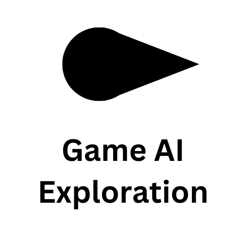
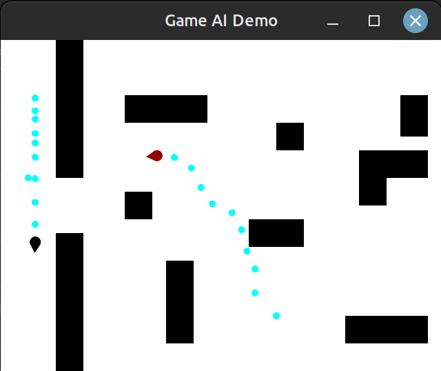

<!--
  Created by: Ethan Baker (contact@ethanbaker.dev)
  
  Adapted from:
    https://github.com/othneildrew/Best-README-Template/
-->

<!-- PROJECT SHIELDS/BUTTONS -->
[![Stargazers][stars-shield]][stars-url]
[![Issues][issues-shield]][issues-url]
[![LinkedIn][linkedin-shield]][linkedin-url]

  

<!-- PROJECT SPECIFIC BUTTONS -->

<!-- PROJECT LOGO -->
 

  

  <h3 align="center">Game AI Exploration</h3>

  

    An exploration of how artificial intelligence plays a role in modern games
  

<!-- TABLE OF CONTENTS -->

  
Table of Contents

  <ol>
    <li>
      <a href="#about-the-project">About</a>
      <ul>
        <li><a href="#built-with">Built With</a></li>
      </ul>
    </li>
    <li>
      <a href="#getting-started">Getting Started</a>
      <ul>
        <li><a href="#prerequisites">Prerequisites</a></li>
        <li><a href="#installation">Installation</a></li>
      </ul>
    </li>
    <li><a href="#license">License</a></li>
    <li><a href="#contact">Contact</a></li>
  </ol>

<!-- ABOUT -->
## About

This project is the culmination of an introduction to game AI class I took at university. Throughout the course, I built up a game engine completely from scratch that was designed to show the effectiveness and performance of different artificial intelligence methods used in modern-day games.

This project is meant to be set up in the most abstract way possible in order to provide a workflow that requires the least amount of coding for each scene. The environment has various folders containing different functionality for this abstract behavior and contains unique folders representing a scene (a scene is a unique render window that is used as a demo).

The abstract parts of the homework include a few key classes that perform the following functions:

* Engine: this represents the actual game engine. It contains various configurable settings that change the game environment, and it manages rendering entities and breadcrumbs. It extends the `sf::RenderWindow` class for added functionality that individual entities can access.
* Entity: this represents any dynamic entity in the game engine. Entities get updated periodically and have associated behaviors that control the entity’s acceleration in the environment. It encapsulates the `sf::Sprite` class with extra functionality.
* Environment: this represents pathfinding and pathfollowing functionality. Different representations of an environment can be used, with demos using a grid environment. This class provides methods to localize vertices and quantize positions, as well as generate obstacles that can be rendered on a specific row and column. 
* Mouse: this represents the mouse’s movement on the window. It is a controller class that records the mouse’s position, velocity, and last clicked location. A mouse controller is associated with a given engine.
* Steering: this class contains multiple steering algorithms and behaviors. There are basic variable matching behaviors that extend a common virtual class, and there are weighted behaviors that take the abstract idea of matching variables and apply them to specific situations (such as aligning a character’s orientation to the direction of motion, or matching a character’s position to the center of a mass).
* Utils: this class contains helpful methods and classes to facilitate the scenes, such as an extended array class with distance searching functionality, a static math class with helpful vector math and random generating functions, or multiple graph datatypes used for decision/behavior trees.

Then, each scene uses these abstract classes in order to create a unique environment for each scene in each demo. The comprehensive abstract engine and easy setup allows the scene to be constructed with minimal hardcoding. 

(<a href="#top">back to top</a>)

### Built With

* [C++][tool-1-url]
* [SFML][tool-2-url]

(<a href="#top">back to top</a>)

<!-- GETTING STARTED -->
## Getting Started

This project exists as a demonstration of my skills in C++, SFML, and AI algorithms. This project should not be used for any school assignments, and full copyright is retained on this project. 

However, this project does contain demos that anyone can run and view. Steps to run the demos exist below.

### Prerequisites

* C++ is installed
* [SFML](https://www.sfml-dev.org/download.php) is installed
* Make is installed

Note that C++ compiling can provide different beahvior on different systems. This project was created to work without issue on Ubuntu 20.04. If you ever have issues compiling this project on your system, try this standard environment.

### Installation

1. Clone this project
1. Navigate to the base directory of this project
1. Run `make`
1. Run the binary generated from make (`./main`)

This will start up the first of three different scenes. You can progress to the next scene by closing the current one.

* Scene A: Run a decision tree for a single character
* Scene B: Run a behavior tree between a character and a "monster"
* Scene C: Run a learned decision tree of Scene B

(<a href="#top">back to top</a>)

<!-- LICENSE -->
## License

This project retains all copyright. Nobody else can copy, distribute, or modify this work. You are only allowed to fork or clone this project to view demonstrations.

&copy; 2023 Ethan Baker

(<a href="#top">back to top</a>)

<!-- CONTACT -->
## Contact

Ethan Baker - [contact@ethanbaker.dev](mailto:contact@ethanbaker.dev) - [LinkedIn][linkedin-url]

Project Link: [https://github.com/ethanbaker/game-ai][project-url]

(<a href="#top">back to top</a>)

<!-- MARKDOWN LINKS & IMAGES -->
<!-- https://www.markdownguide.org/basic-syntax/#reference-style-links -->
[contributors-shield]: https://img.shields.io/github/contributors/ethanbaker/game-ai.svg?style=for-the-badge
[forks-shield]: https://img.shields.io/github/forks/ethanbaker/game-ai.svg?style=for-the-badge
[stars-shield]: https://img.shields.io/github/stars/ethanbaker/game-ai.svg?style=for-the-badge
[issues-shield]: https://img.shields.io/github/issues/ethanbaker/game-ai.svg?style=for-the-badge
[license-shield]: https://img.shields.io/github/license/ethanbaker/game-ai.svg?style=for-the-badge
[linkedin-shield]: https://img.shields.io/badge/-LinkedIn-black.svg?style=for-the-badge&logo=linkedin&colorB=555

[contributors-url]: <https://github.com/ethanbaker/game-ai/graphs/contributors>
[forks-url]: <https://github.com/ethanbaker/game-ai/network/members>
[stars-url]: <https://github.com/ethanbaker/game-ai/stargazers>
[issues-url]: <https://github.com/ethanbaker/game-ai/issues>
[pulls-url]: <https://github.com/ethanbaker/game-ai/pulls>
[license-url]: <https://github.com/ethanbaker/game-ai/blob/master/LICENSE>
[linkedin-url]: <https://linkedin.com/in/ethandbaker>
[twitter-url]: <https://twitter.com/_ethanbaker>
[project-url]: <https://github.com/ethanbaker/game-ai>

[conventional-commits-url]: <https://www.conventionalcommits.org/en/v1.0.0/#summary>
[conventional-branches-url]: <https://docs.microsoft.com/en-us/azure/devops/repos/git/git-branching-guidance?view=azure-devops>
[tool-1-url]: <https://en.wikipedia.org/wiki/C++>
[tool-2-url]: <https://www.sfml-dev.org/>